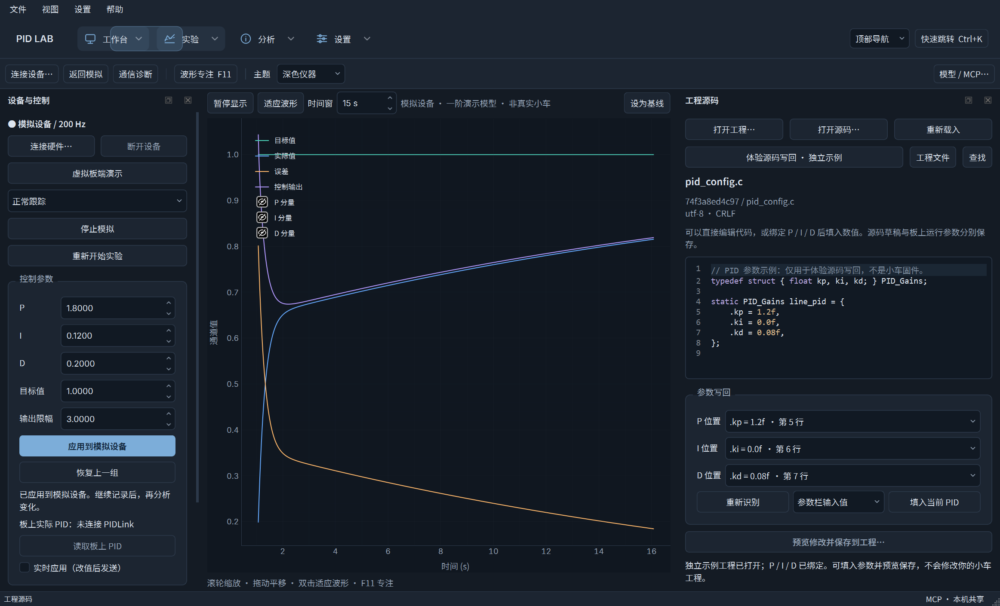
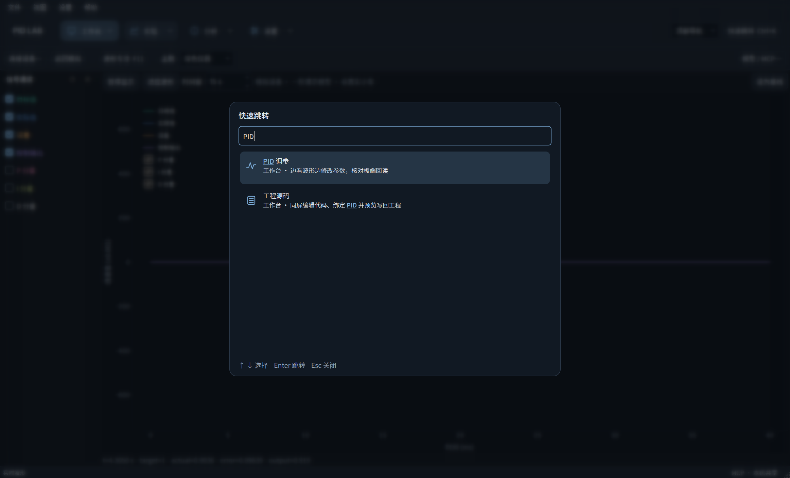

# PID Lab · PID 调参助手

**边看波形，边调 PID。**

一款 Windows 原生桌面工具，把实时波形、PID 参数、数据看板和实验分析放进同一个工作台。双击 EXE 即可体验，无需安装 Python；默认使用模拟设备，不需要 API Key。

[下载 Windows 版 v0.6.0](https://github.com/Looiseves/PID-/releases/tag/v0.6.0) · [使用说明](docs/USER_GUIDE.md) · [界面图集](docs/UI_GALLERY.md) · [版本记录](CHANGELOG.md)


*大波形区与独立信号列表。截图为本地模拟数据。*

v0.6.0 统一深浅工作台、参数栏、看板、表格和设置弹窗；源码区提供行号与语法颜色，保存预览区分增删。全部工作区截图见[界面图集](docs/UI_GALLERY.md)。

## 主要功能

- **串口实时调参**：读取板端实际 P/I/D，修改后发送，收到匹配回读才确认生效；波形持续采集并标出确认时刻。
- **工程源码写回**：波形旁直接编辑 C/C++ 文件，绑定 P/I/D 并填入参数；预览差异后保存，保留原文件备份，检查 IDE 外部修改。
- **波形与看板**：多通道绘图、缩放与采样点查看、自定义参数卡片；支持串口、蓝牙虚拟 COM 和 BLE 数值采集。
- **实验对比**：设定基线，比较曲线和指标；记录备注、保存实验、CSV 导出与离线回放。
- **Dashboard 导航**：顶部通栏菜单与单组展开侧栏，滑动高亮，Ctrl+K 搜索跳转；F11 放大波形，深浅主题与布局保存。
- **Codex / API 接入**：MCP 读取波形与实验，或通过自定义 API Key 分析；建议先审阅，参数由你应用。

## 同屏调参


*参数、波形和分析放在同一屏。中文使用 Noto Sans SC，数字与刻度使用 Inter；字体随应用打包。*

真实小车需在已有固件中接入 [PIDLink 接口](firmware/README.md)，绑定已有 PID。当前提供通用 C99 接口和虚拟板端演示，尚未接入具体小车工程或完成物理验证。支持运行时调参和所选源码文件写回；写 Flash 和编译烧录仍待接入。

## 边看波形边改代码



“工作台 → 工程源码”打开本地工程与 C/C++ 文件，可直接编辑，或绑定三个数值位置后填入参数栏 / 板端确认值。保存前展示完整差异并备份原文件；如果 IDE 改过文件，停止覆盖并要求重新载入。没有工程也可通过独立示例体验，截图为示例代码与模拟数据。


## 快速跳转



`Ctrl+K` 打开命令面板，输入页面名或 PID / MCP / API；上下键选择，回车跳转，Esc 关闭。背景模糊压暗，底层采集继续。

## 开始体验

1. 从 [Releases](https://github.com/Looiseves/PID-/releases) 下载 Windows x64 压缩包，完整解压。
2. 双击文件夹中的 `PID调参助手.exe`，保留 `_internal` 文件夹。
3. 在顶部“工作台”进入“PID 调参”，点击“虚拟板端演示”。
4. 调整一个参数，观察回读确认与曲线变化，再设为基线做对比。

默认演示不连接真实硬件。`PIDAssistant-MCP.exe` 由 Codex 启动，无需单独双击。模型分析按你配置的供应商计费，只在主动点击后发送实验数据。

## 文档与开发

- [使用说明与接入配置](docs/USER_GUIDE.md)
- [固件串口接口](firmware/README.md)
- [验证范围](VALIDATION.md) · [依赖与字体许可](THIRD_PARTY.md)
- [中文版本记录](CHANGELOG.md)

```powershell
python -m venv .venv
.\.venv\Scripts\python.exe -m pip install -r requirements.txt
.\.venv\Scripts\python.exe app.py
```

每个交付版本保留独立 Git 提交、版本标签和更新说明。项目代码采用 [MIT](LICENSE) 许可；第三方依赖和字体分别遵循其原有许可。
